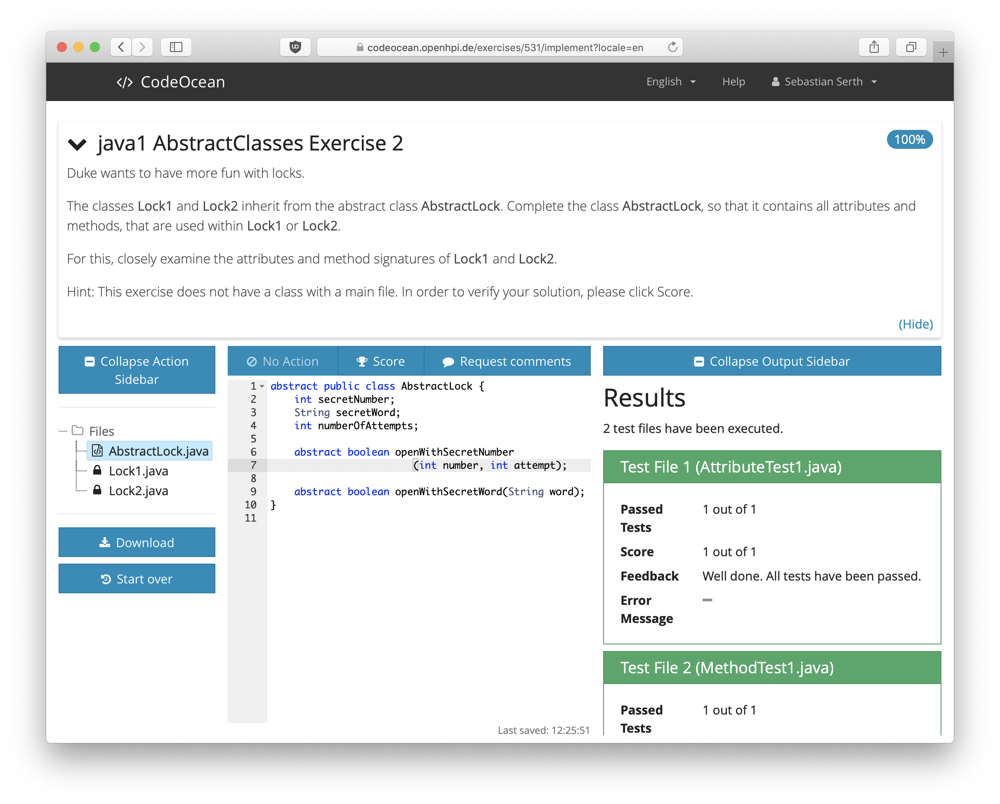

# CodeOcean

## Introduction

CodeOcean is an educational, web-based execution and development environment for practical programming exercises designed for the use in Massive Open Online Courses (MOOCs).

The programming courses offered on openHPI include practical programming exercises that are provided on a web-based code execution platform called CodeOcean. The platform has many advantages for learners and teachers alike:

1. CodeOcean offers a predefined view on the exercises with scaffolded source code including syntax highlighting and allows editing these files directly within the browser.
2. The platform allows executing the code on the server and streams the output back to the learner’s web browser. Together with the customized view, learners are supported to get up with the programming in no time instead of taking care of the development environment. Learners do not need to download and install any compiler or runtime. Thus, MOOC instructors minimize technical help requests about correct machine setup and can focus forum posts on the content provided in the course.
3. CodeOcean includes unit tests to provide feedback for learners and score their code. A unit test is defined as a program that either runs the learner’s code in a pre-defined way and compares the provided result with an expectation or the unit test parses the student’s source code and matches it against an exercise-defined string. While the code of the unit tests are hidden, learners can run the unit tests at any time and get instant feedback whether they passed or failed. If the unit tests fail the result is shown together with an error message defined by the MOOC instructors. On the one hand, this feedback helps people to help themselves and provides learners with a hint of their mistake. On the other hand, the automated scoring using unit tests is required to indicate progress for the learners. In the context of a MOOC with thousands of active learners, a manual review by the instructors is not feasible and peer-review of source code has not been implemented in CodeOcean so far.
4. In CodeOcean, learners can ask questions about their program directly within the platform and in context of their current program. Usually, MOOC platforms provide a forum to discuss questions. While this concept also works great for source code in general outside of a MOOC (cf. [StackOverflow](https://stackoverflow.com)), it is an additional barrier for novices to summarize their problem externally. To understand the problem, contextual information is generally of help for others to provide the current solution. When using a dedicated forum, learners are required to provide as much information as necessary to reproduce the issue which beginners might find difficult to identify. As a result, they might copy too few or too much information. In addition, early iterations of the Java courses showed that learners did not format their source code appropriate in forum posts (but as plain text), making it difficult to read. With _Request for Comments_, CodeOcean provides a built-in feature to ask a question in the context of an exercise, thus lowering the barriers to get help. CodeOcean presents the learner’s source code and error message together with the question to fellow students and allows them to add a comment specifically to one line of code. Hence, the previously described issue is solved with a dedicated forum.

CodeOcean is mainly used in the context of MOOCs (such as those offered on openHPI) and has been used by more than 120,000 users as of August 2024. CodeOcean is a stand-alone tool implementing the [Learning Tools Interoperability (LTI)](https://www.imsglobal.org/activity/learning-tools-interoperability) standard to be used in various learning scenarios. By offering an LTI interface, it is accessible from MOOC providers as well as other Learning Management Systems (LMS), such as Canvas, Moodle, or dBildungscloud. CodeOcean itself cannot be used directly by learners or other users than the MOOCs instructors or administrators.

## Development Setup

Please refer to the [Local Setup Guide](docs/LOCAL_SETUP.md) for more details. Please note that the [Dockerfile](Dockerfile) is intended for production only.

In order to execute code submissions, a so-called Runner Management is required. The Runner Management is a separate service that is responsible for executing the code submissions in a secure and isolated environment. Historically, CodeOcean used a separate service called [DockerContainerPool](https://github.com/openHPI/dockercontainerpool) for this purpose, which has been replaced by [Poseidon](https://github.com/openHPI/poseidon) many years ago. Poseidon is the recommended setup for CodeOcean. Please refer to the [Poseidon repository](https://github.com/openHPI/poseidon) for more information.

The chosen runner management is configured in `config/code_ocean.yml.erb` and likely requires manual setup for development and production use.

### DockerContainerPool Setup
When CodeOcean is configured to use the [DockerContainerPool](https://github.com/openHPI/dockercontainerpool) for executions, source code files are first written to the file system and are then mounted to a dedicated Docker container. These files are temporarily written to `Rails.root.join('/tmp/files')`. Please make sure that the `workspace_root` in `config/docker.yml.erb`
- corresponds to that directory or to a linked directory if using a remote Docker server.
- is always writeable by the user executing the web server (in this case the `codeocean` user): `setfacl -Rdm user:codeocean:rwx /var/www/app/current/tmp/files`.

### Poseidon Setup
The usage of [Poseidon](https://github.com/openHPI/poseidon) is highly recommended: It is more stable, can be scaled more easily, and executions are stronger isolated from each other. For the Poseidon setup, no shared filesystem is required. Instead, Poseidon provides a RESTful API used by CodeOcean and relies on the container orchestrator [Nomad](https://nomadproject.io) for the actual executions. Please refer to the [Poseidon repository](https://github.com/openHPI/poseidon) for more information, architectural considerations, and setup instructions.

## Production Setup
- We recommend using [Capistrano](https://capistranorb.com/) for deployment. Alternatively, the [Dockerfile](Dockerfile) can be used to build a production-ready Docker image containing the Rails application. The devcontainer and Vagrant setup are for local development only.
- Once deployed, CodeOcean assumes to run exclusively under a (sub)domain. If you want to use it under a custom subpath, you can specify the desired path using an environment variable: `RAILS_RELATIVE_URL_ROOT=/codeocean`. Please ensure to rebuild all assets and restart the server to apply the new path.
- When using [PgBouncer](https://www.pgbouncer.org), please make sure to correctly set the `intervalstyle` to `iso_8601` for the database. Otherwise, the application will not be able to parse timestamps correctly. See [a similar issue here](https://gitlab.com/gitlab-org/gitlab/-/issues/349912) and [our migration](./db/migrate/20221206221333_set_database_interval_style.rb) for more details.
- A Runner management is required for executing code submissions. Please refer to the [Development Setup](#development-setup) section for more details.

## Monitoring
- We use a [Prometheus Exporter](https://github.com/discourse/prometheus_exporter) and a [Telegraf Client](https://github.com/jgraichen/telegraf-ruby)
- The Telegraf client collects the data from the Prometheus endpoint, adds its own datasets and forwards them to an InfluxDB
- The Prometheus Exporter must be started separately **before** running the Rails server via `bundle exec prometheus_exporter`
- The InfluxDB data can be visualized using Grafana, for example. For the data gathered through Prometheus, rhere is also an adapted [dashboard](docs/grafana/prometheus_exporter_grafana_dashboard.json). For request-based data gathered through the Telegraf Client, potential dashboards are shown in the [telegraf-ruby repository](https://github.com/jgraichen/telegraf-ruby/tree/e498bebdadc0c525e45ca18d1fbb1ab735e88c77/examples).

## Additional Note
- If you want to change the default port of the underlying rails server, you can use [authbind](https://www.mwells.org/coding/2016/authbind-port-80-443/) to bind it to the regular 80/443 port.

## Contributing

Bug reports and pull requests are welcome on GitHub at https://github.com/openHPI/codeocean. This project is intended to be a safe, welcoming space for collaboration, and contributors are expected to adhere to the [code of conduct](https://github.com/openHPI/codeocean/blob/main/CODE_OF_CONDUCT.md).

## License

CodeOcean is available as open source under the terms of the [BSD 3-Clause License](https://opensource.org/licenses/BSD-3-clause).

## Code of Conduct

Everyone interacting in this project's codebases, issue trackers, chat rooms and mailing lists is expected to follow the [code of conduct](https://github.com/openHPI/codeocean/blob/main/CODE_OF_CONDUCT.md).
